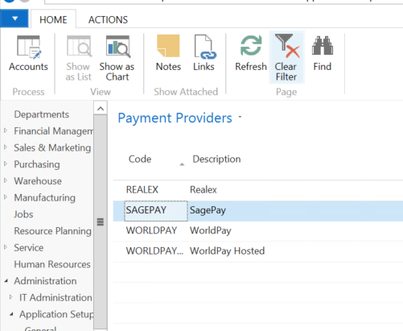

In NAV, go to **Departments \> Administration \> Application Setup \> Financial
Management \> Payment Gateway** and select **Payment Gateway Setup.**

This page defines how NAV connects to the Payment Gateway service from
Technology Management.

From the **Payment Gateway Setup** Screen, go to the Actions tab in the Ribbon
and select **Get Default Configuration**.

Selecting this will complete all the details for the Web Service apart from the
password.

When purchasing this Addition from Technology Management you will be allocated a
Tenant Code and Access Key, these are your unique identifiers. The combination
of these two ensures a payment can only be taken for the set specific company, a
payment cannot be taken on behalf of a different company.

In NAV, go to **Departments \> Administration \> Application Setup \> Financial
Management \> Payment Gateway.** Under the list option there are three
categories, Payment Providers, Payment Provider Account and Payment Provider
Acc. Priority.

### Payment Provider

If **Payment Provider** is selected the default payment providers will be
presented. Highlighting the relevant payment provider select **Accounts** in the
Home tab on the Ribbon.

This presents the Payment Provider account for that provider.

These accounts need to be setup and with all the information populated. To do
this, select new in the top left-hand corner.

All the fields need to be populated correct and account specifically for the set
up to work as it should. Each customer will have their own account details which
can be filled in here.

Once completed select ok. The account will now be set up.

### Payment Provider Account 

If Payment Provider Account is selected, this shows all the accounts that have
been set up for each account type, such as Sage Pay, WorldPay etc. New accounts
can also be created in the section; however, users will need to select the
correct **Payment Provider Code** as this will not be automatically populated.
These accounts can be created in the same way as previously stated, and the
correct information will need to be populated.

### Payment Provider Acc. Priority 

If Payment Provider Acc. Priority is selected, user can set up which account
will be associated with which document type. For example, when a sales order is
requesting payment, it will automatically select to use a WorldPay account. This
will then be set as the default payment account but can be changed if needed.

To set these up, select New in the top left-hand corner and a filter page will
pop up.

User will need to enter the table number, criteria, payment provider and
description.

To select the criteria, a drill down option will be presented in the corner (3
dots). Clicking on this will give the user filters to use to create their
criteria.

These filters can be used to select whatever is required by the user.

Customer Card (optional) 
-------------------------

A Payment Method Code can be set on the Customer Card for each customer, this
can be set to default to Sage (or another Payment Provider such as WorldPay).
This will be pulled though on sales documents as the default payment method but
can easily be changed on the document. Or it can be left blank and selected for
each order.

*Note: if this option has been used Payment Gateway V1, then it will be pulled
through as a new Account in V2.*
