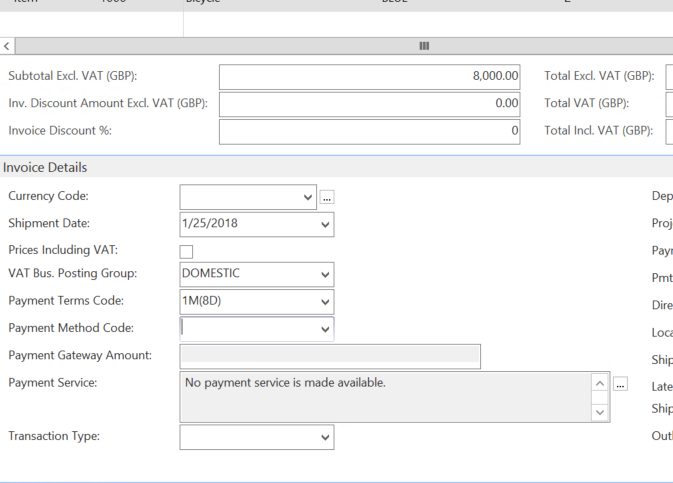
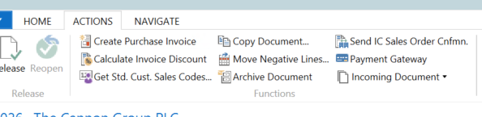
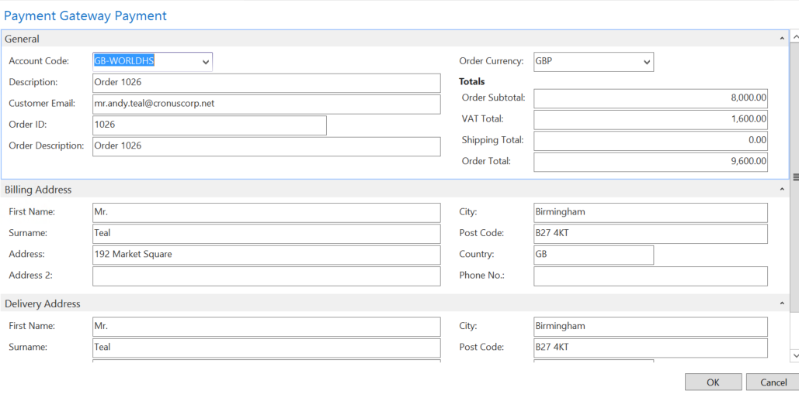
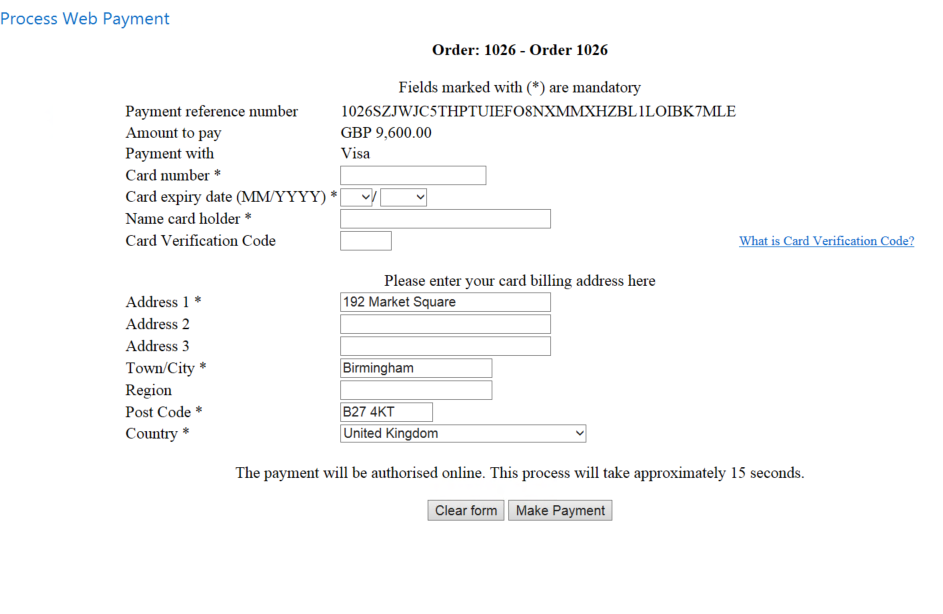
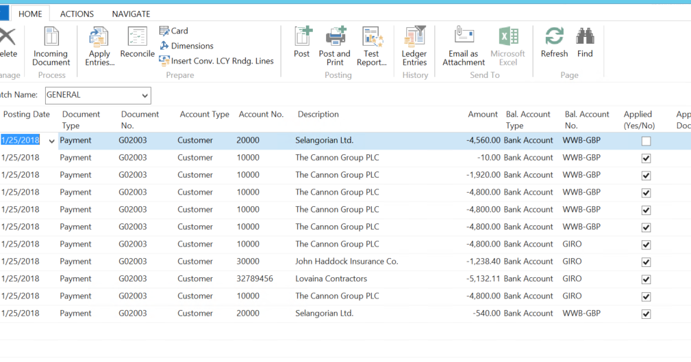
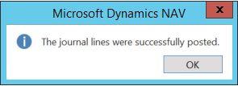
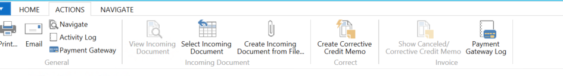
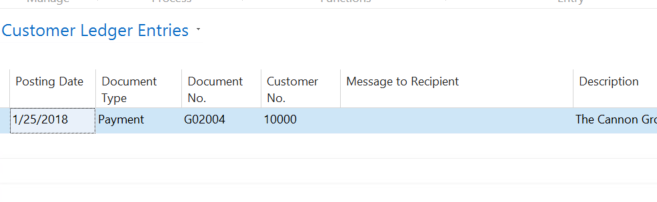
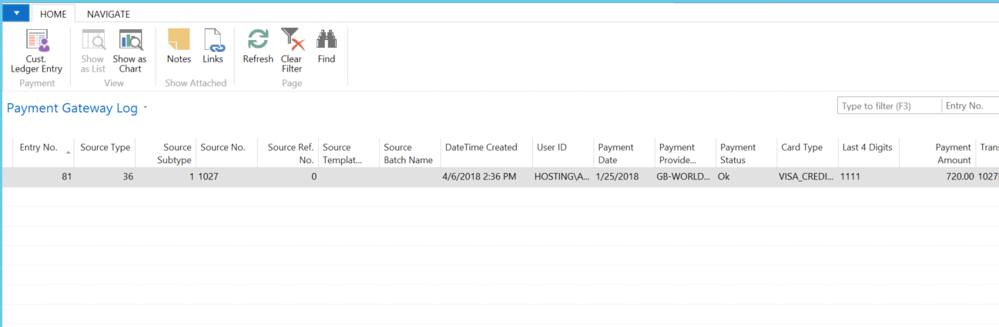

Creating a Sales Order
----------------------

On the Sales Order, sales lines are entered as normal.

A Payment Method Code will be pulled through from the Customer Card if one has
been set, otherwise it can be left blank. The Payment Gateway Amount field will
be empty initially but will be completed after payment has been taken, showing
the amount received through the Payment Gateway.

Taking a Payment
----------------

Once a sales order has been completed, before being released go to the Action
Tab in the Ribbon and Select Payment Gateway.

A dialogue box is triggered within NAV to confirm the billing and delivery
addresses, the currency used and the amounts before redirecting to the Payment
Provider. Ensure that the **Account Code** is populated, if not, one needs to be
selected now. If one isn’t selected, **Payment Gateway** will promote the use to
enter one before continuing.

*Note: This box is only triggered if ‘Show Payment Page’ has been setup on the
Payment Provider Account, or if there is no Payment Provider Acc. Priority set
for this document filter.*

When OK is pressed these details are sent over to the Payment provider, who
sends back a pop-up page in a new window to take the payment. This window is
still in NAV, it does not use a web-browser.

Enter the card number details, confirm/change the billing address details if
these are not the correct ones for the credit/debit card being used then click
the ‘Pay’ button.

If successful, a message will be received.

Back in the sales order, refresh the sales order (F5) it will now display an
amount in Payment Gateway Amount and the Sales Order can be released and then
posted.

Payment Gateway Log
-------------------

In NAV, go to **Departments \> Financial Management \> Receivables \> History \>
Payment Gateway Log,** this is used to check the details of the
payment/transactions.

This shows the details of the payment(s) taken, their outcome (Payment Status),
the Payment Amount received.

All transaction have a unique Transaction ID which are used to identify the
transaction

.

At this point it is a record of a payment into the system but is not yet applied
against any specific invoice (Cust. Ledg. Entry No.), it has not yet been posted
as cash. If the payment failed there will be an explanation in the Status
Details Column.

Posting the payment 
--------------------

In NAV, go to **Home \> Cash Receipt Journal** and select the cash receipts
journal that is required.

Navigate to the Action Tab in the Ribbon once the payment journal has been
opened and select ‘**Suggest Paym. Gateway Payment’**. This allows filtering to
be the entries for what day/week or a customer order.

This is now applied to the Posted Invoice in NAV. The tick in Applied Yes/No
means the payment has been successfully matched to one or more invoices. To see
what it has been applied against, go to the Home Tab on the Ribbon, and choose
Apply Entries.

When the system inserts the Journal line it will attempt to find one or more
invoices that have been posted from the Order against which the payment was
originally taken. This could be multiple invoices. It will match them up and set
the Applies to ID for them, ready for posting.

If the system does not find invoices to match against, these can be set manually
using the “Set Applies to ID” option, in the Applied Customer Entries. This
button can be found on the Action tab in the Ribbon.

Once the journals have been posted, a success message will appear.

Reviewing the Posted Entries Relating to the Payment 
-----------------------------------------------------

In NAV, go to **Posted Documents \> Posted Sales Invoices.** Select the invoice
that has just been posted and navigate to the Action Tab in the Ribbon. There is
an icon to get a filtered view of the **Payment Gateway Log.**

The Payment Gateway Log confirms the payment was taken against Sales Order and
that is has a Customer Ledger Entry No. Selecting Cust. Ledger Entry opens the
Ledger Entry.
